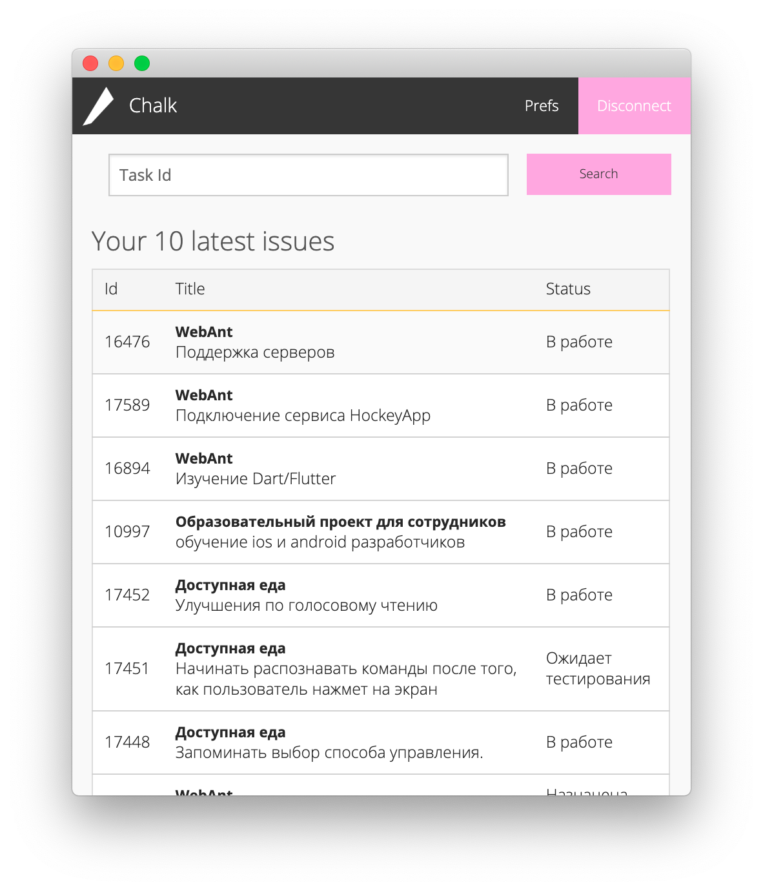
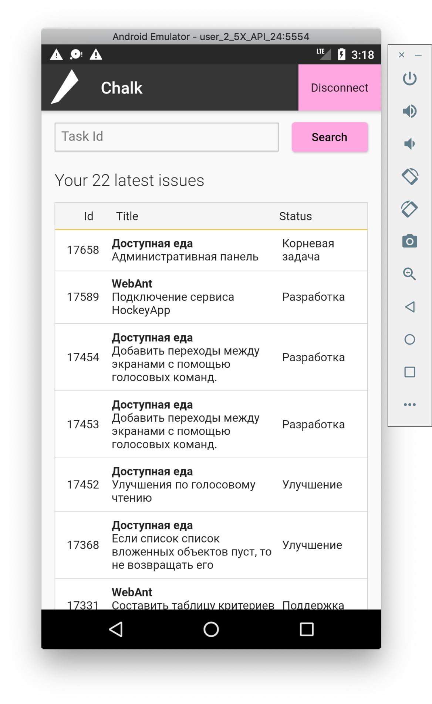

# Chalk

Flutter copy of [another Redmine time tracker](https://github.com/vmeron/Chalk)  

Key features:
 * Redux
 * Clean Architecture
 * Android, iOS deeplink handling

Original Chalk:
<div align = "center">

</div>

Unbelievable copy:
<div align = "center">


</div>


# Development 

#### TODO:
* Opening app by browser link. Android, iOS - Done. MacOs, Linux - Pending

### Upgrading Flutter for desktop development

```bash
flutter channel master && flutter doctor
```

By data 16.07.19 plugin for IDEA doesn't support running Desktop apps, need to launch with command line.

### Desktop app launch

Run app:

```bash
export ENABLE_FLUTTER_DESKTOP=true

flutter run --pid-fil=j098765432 /tmp/flutter.pid
Или
flutter run --pid-file /tmp/flutter.pid -d macOS
```

Run file observing for hot-reload.
```bash
./observe_changes.sh
```

Run codegeneration:
```bash
flutter pub run build_runner watch --delete-conflicting-outputs
```